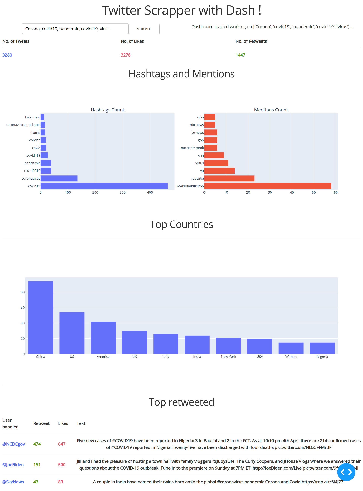

# Twitter dashboard using dash



A dashboard that shows you some analysis based on multiple queries.

## Usage and installation

1.Create and activate a virtual environment

```bash
$python -m venv venv
$source venv/bin/activate
```

2.Install all the requirements

```bash
$pip install -r requirements.txt
```

3.Run the app

```bash
$python app.py
```
